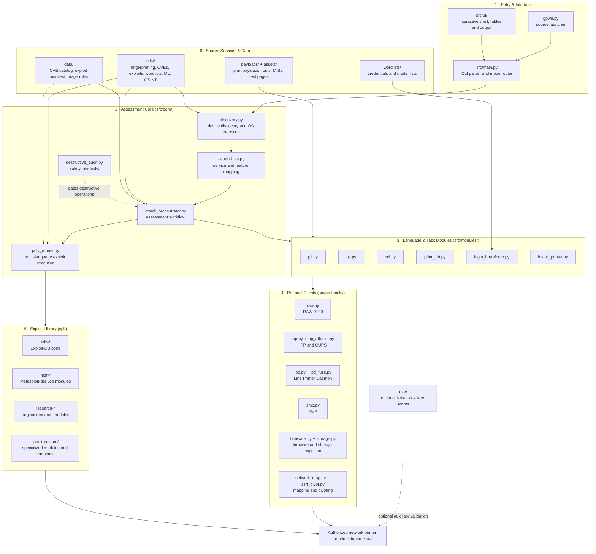

<div align="center">

# GutenPwn

**Advanced Network Printer Security Assessment Framework**


[](https://python.org)
[](LICENSE)
[](https://github.com/Hayder-Rzaigui/GutenPwn/releases)
[]()
[](https://github.com/Hayder-Rzaigui/GutenPwn)

**[Documentation](https://github.com/Hayder-Rzaigui/GutenPwn/wiki)** · **[Issues](https://github.com/Hayder-Rzaigui/GutenPwn/issues)** · **[Releases](https://github.com/Hayder-Rzaigui/GutenPwn/releases)** · **[Contributing](CONTRIBUTING.md)** · **[Code of Conduct](CODE_OF_CONDUCT.md)**

</div>

---

## Overview

GutenPwn is a modular, protocol-complete framework for authorized security assessment of network printers and print infrastructure. It implements the full printer attack surface — device languages, network protocols, credential attacks, and post-exploitation — behind a single unified CLI.

| Capability | Details |
|---|---|
| **Device languages** | PJL, PostScript, PCL, ESC/P, ASCII |
| **Protocols** | RAW (9100), IPP, LPD, SMB, HTTP/S, SNMP, FTP, Telnet, WSD, TFTP |
| **Exploit arsenal** | 185+ exploit modules across 30 years of printer vulnerabilities |
| **CVE coverage** | NVD-integrated detection for 120+ CVEs |
| **Credential engine** | External wordlist-driven brute force — zero hardcoded passwords |
| **Fingerprinting** | ML-assisted device identification |
| **Exploit orchestration** | Multi-language `poly_runner`: Python, C/C++, Ruby/Metasploit, Go, Rust |
| **Post-exploitation** | Lateral movement, firmware analysis, Cross-Site Printing (XSP) payloads |

---

## Installation

**From source (recommended):**

```bash
git clone https://github.com/Hayder-Rzaigui/GutenPwn.git
cd GutenPwn
./setup_venv.sh        # Linux/macOS  (setup_venv.ps1 on Windows)
./run.sh --help
```

**Via pip (PyPI):**

```bash
pip install gutenpwn
gpwn --help
```

**Optional — NSE auxiliary scripts:**

```bash
gutenpwn-nse           # installs bundled Nmap NSE scripts
```

---

## Quick Start

```bash
gpwn                                  # interactive guided menu
gpwn 192.168.1.100 --scan             # passive reconnaissance & fingerprinting
gpwn 192.168.1.100 pjl                # interactive PJL shell
gpwn 192.168.1.100 --bruteforce --bf-vendor epson
gpwn 192.168.1.100 --safe --auto-detect
gpwn --discover-local                 # discover printers on the local network
```

### Common options

| Option | Description |
|---|---|
| `-t, --target` | Target host or CIDR range |
| `--safe` | Enable safety interlocks on destructive modules |
| `-q, --quiet` | Suppress warnings and banner |
| `-d, --debug` | Debug mode (show raw protocol traffic) |
| `-i, --load FILE` | Load and run commands from a file |
| `-o, --log FILE` | Log raw data sent to the target |
| `--osint` | OSINT enrichment pass |
| `--auto-detect` | Automatic protocol/language detection |
| `--port-raw/--port-ipp/...` | Override default service ports |
| `--discover-local / --discover-online` | Local discovery / internet-wide discovery |
| `--dork-*` | Shodan-style dorking (`--dork-vendor`, `--dork-model`, `--dork-country`, ...) |

---

## Architecture

GutenPwn uses a layered architecture that separates the command interface, assessment workflow, language modules, protocol clients, and exploit data. The design keeps protocol handling isolated, makes language features reusable, and allows the orchestration and exploit-triage services to evolve independently.



### Layer responsibilities

| Layer | Primary paths | Responsibility |
|---|---|---|
| **Entry & Interface** | `gpwn.py`, `src/main.py`, `src/ui/` | Parse CLI arguments, route commands and interactive modes, and present structured results. |
| **Assessment Core** | `src/core/` | Coordinate discovery, fingerprinting, capability mapping, attack workflows, exploit execution, and destructive-operation safeguards. |
| **Language & Task Modules** | `src/modules/` | Provide reusable PJL, PostScript, and PCL operations plus higher-level tasks such as print jobs, credential attacks, and printer installation. |
| **Protocol Clients** | `src/protocols/` | Encapsulate RAW, IPP/CUPS, LPD, SMB, firmware, storage, network-mapping, and pivoting interactions behind consistent interfaces. |
| **Exploit Library** | `xpl/`, `tools/xpl_cli.py` | Store categorized exploit modules and metadata, with `poly_runner` handling Python, C/C++, Ruby/Metasploit, Go, and Rust execution. |
| **Shared Services & Data** | `src/utils/`, `src/data/`, `src/payloads/`, `src/assets/`, `wordlists/` | Supply fingerprinting, vulnerability intelligence, exploit triage, wordlists, reusable payloads, fonts, MIBs, and test pages. |
| **Auxiliary & Distribution** | `nse/`, `packages/`, `man/`, `diagrams/`, `docs/`, `wiki/`, `tests/` | Add optional Nmap support, package installers, documentation, architecture diagrams, and regression tests. |
Editable diagram sources (draw.io / Mermaid) live in [`diagrams/`](diagrams/).

---

## Project Layout

```text
GutenPwn/
├── gpwn.py              # Source-tree launcher and runtime bootstrap
├── run.sh / run.ps1     # Convenience runners
├── setup_venv.sh/.ps1   # Virtual-environment setup
├── src/
│   ├── main.py          # CLI parser, command router, and mode dispatch
│   ├── core/            # Discovery, capabilities, orchestration, safety, poly_runner
│   ├── modules/         # PJL, PostScript, PCL, jobs, brute force, installation
│   ├── protocols/       # RAW, IPP, LPD, SMB, firmware, storage, mapping, pivoting
│   ├── utils/           # Fingerprinting, CVEs, wordlists, ML, OSINT, configuration
│   ├── data/            # CVE catalog, exploit manifest, and triage metadata
│   ├── payloads/        # Reusable print-language payloads
│   ├── assets/          # Fonts, MIBs, overlays, and test pages
│   └── ui/              # Interactive shell, banners, spinners, and tables
├── xpl/                 # 185+ categorized exploit modules and index metadata
├── wordlists/           # Printer-focused credentials and model lists
├── nse/                 # Bundled Nmap NSE scripts and installer
├── tools/               # Environment diagnostics, bootstrap, and exploit-library CLI
├── diagrams/            # Editable draw.io/Mermaid architecture diagrams
├── docs/                # In-depth technique documentation
├── wiki/                # User and operator documentation
├── packages/            # PyPI, DEB, RPM, and pipx packaging
├── man/                 # Unix man page
└── tests/               # Regression tests
```

---

## Safety & Legal Notice

GutenPwn is intended **exclusively for authorized security testing** on systems you own or have explicit written permission to assess. Several modules perform **destructive and irreversible operations** (factory resets, NVRAM wipes, firmware flashes). Always use the `--safe` interlock outside isolated lab environments. The author and copyright holder accept no liability for misuse or damage. See [LICENSE](LICENSE) (MIT).

---

## Author & License

**Copyright (c) 2024-2026 Hayder Rzaigui** — released under the [MIT License](LICENSE).
Contributions, issues, and pull requests are welcome.
